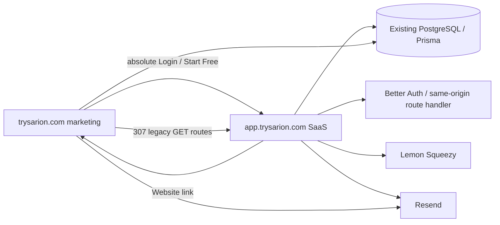

# Sarion marketing and SaaS separation audit

Audit date: 2026-10-06. Baseline commit: `9a813faf4e667dc2eb67b63aef65950d9f7ed689`.

## Current architecture discovered

The repository was a single Next.js 15.5.19 App Router application with React 19, Prisma 6/PostgreSQL, Better Auth 1.6.15, Resend, Lemon Squeezy, PostHog, Sentry, and Docker standalone output. There is no separate backend, API host, object storage, WebSocket, OAuth provider, or deployed infrastructure configuration in the repository. All application APIs are Next route handlers.

The working tree already contained SEO QA work before this migration. It was preserved. No `.env` value was read into documentation, no database command was run, and no migration was applied.



## Inventory

| Surface | Current implementation | Target owner |
|---|---|---|
| Public marketing/SEO | `(marketing)`, `links`, scorecard report, RSS, contact/leads APIs; 131 sitemap records | marketing |
| Authentication | login, signup, forgot/reset password, verify email, `/api/auth/[...all]` | app |
| Private application | dashboard, activity, automations, clients, projects, invoices, finance, proposals, recurring, reports, settings, team, time | app |
| Public client-facing | `/portal/[token]`, `/p/[shareToken]` | app |
| APIs | activity, auth, billing checkout/portal/webhook, client timeline, cron, email-test, contact, leads | app except contact/leads |
| Middleware | Better Auth cookie presence check before private routes; complete server-side authorization still occurs in pages/actions | app |
| Shared UI | UI primitives, brand assets, theme, analytics, layouts, marketing components | canonical `src/`, consumed by both workspace entrypoints |
| Shared server utilities | Prisma, auth, role/agency authorization, email, billing, rate-limit, scorecard | canonical `src/`; only routes requiring them bundle them |
| Database | One Prisma PostgreSQL schema; 19 local migration directories | unchanged, shared database |
| Integrations | Better Auth email/password only; Lemon Squeezy webhooks; Resend; PostHog/Plausible/GA/Ahrefs/Sentry | app owns product/auth/billing; marketing owns public analytics/contact |

## Security and data observations

- Better Auth has no OAuth providers configured. The application uses email/password, DB sessions, email verification, password reset, and token-gated team invitations.
- Client portals use unique `Client.portalToken`; public proposals use unique `Proposal.shareToken`. Both have noindex metadata and remain on the app host.
- Authorization is tenant-scoped through `requireAgency`/`requireOwner`; the move does not change IDs, permissions, or data access logic.
- No upload/storage SDK, signed uploads, WebSocket, or realtime provider was found. Existing `logoUrl` is only a stored URL.
- Lemon Squeezy webhook processing has an idempotency ledger (`LemonWebhookEvent`) and HMAC verification. Its callback must be moved manually; it must not use a browser redirect.

## Implemented structure

```text
apps/marketing/     independent Next entrypoint, public routes only
apps/app/           independent Next entrypoint, app/auth/portal/API routes only
src/                canonical shared implementation, not a published package
scripts/            route/public-asset generation and migration-map generation
```

`apps/*/public` is generated from canonical `public/` before build and ignored by Git. This prevents duplicate binary assets while allowing both deployment roots to have a native Next `public` directory. Route wrappers are generated from the canonical route tree; metadata image routes are copied because Next requires literal image metadata exports.

## Baseline and limitations

- `npm` and `package-lock.json` are the actual local package strategy. The previous CI referenced pnpm despite no pnpm lockfile; CI now uses npm.
- Docker/Coolify-oriented `output: standalone` exists. `vercel.json` existed only for the recurring-billing cron; no hosting project identifier or DNS state is available locally.
- Migration application status cannot be determined safely without a database connection. The local migration directories were inventoried; no destructive or production database action was performed.
- Existing root-domain host-only session cookies cannot be sent to `app.trysarion.com`. Existing database sessions are preserved, but users need one predictable one-time sign-in on the app host after cutover.

